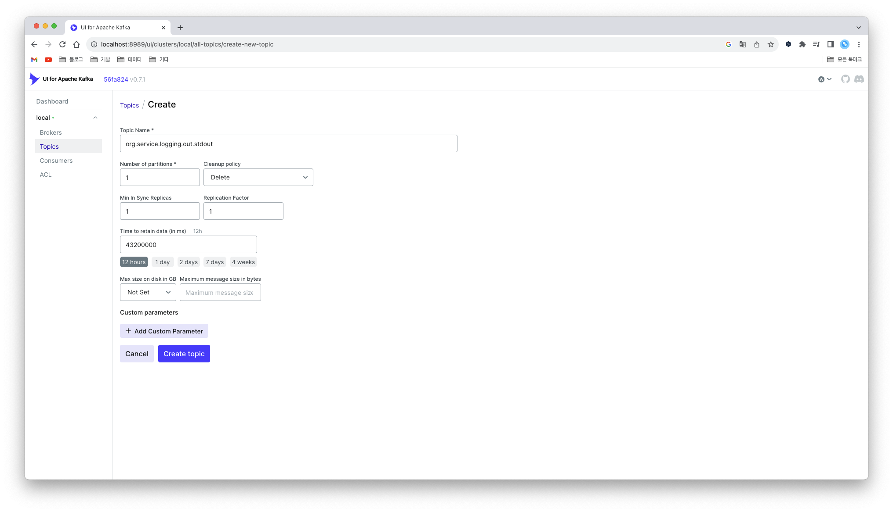

# payment

## money concept

1. money recharge request
2. check account if money can be withdrawn (assume the account already exists)
3. withdraw the money to the corporate account
4. recharge money

## firm-banking concept

1. money recharge request
2. check if the bank fee is greater than the amount you wish to recharge
   - recharge amount < bank fee: recharge 
   - recharge amount > bank fee: request to recharge with an amount greater than the bank fee

   
## transfer concept

### member to member

- simply send money a to b
- single transaction
- money recharge request when sender's money is deficient

### member to non-member (bank)

1. check account if money can be withdrawn (assume the account already exists)
2. withdraw the money to the corporate account
3. send money from corporate account to real(targeted) bank account

## kafka

- without kafka-ui, must execute command to make topic

```shell
$ cd /opt/bitnami/kafka/bin/kafka-topics.sh
$ kafka-topics.sh --create
  --zookeeper <zookeeper:2181>
  --topic <org.service.logging.out.stdout>
  --partitions 1
  --replication-factor 1
  --config min.insync.replicas=1
```

- within kafka-ui



## todo: monitoring

- logging: elastic (indexing), fluent (data fetch), kibana (ui)
- metric: prometheus (timeSeries db), grafana (visualize + alert)
- tracing: jaeger, zipkin, tempo
- service mesh: istio (kiali, envoy-proxy)

## todo: eventuate

- eventuate local: platform which helps implement  event sourcing
- eventuate tram: platform which helps implement saga, cqrs